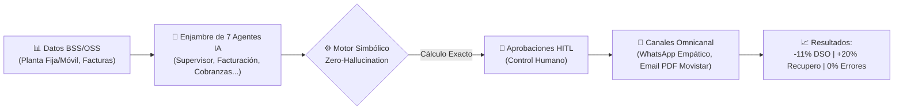

# SON-IA: Sinergia Operativa del Negocio con Inteligencia Artificial
## Presentación Ejecutiva y Documentación del Proyecto para Movistar Empresas

---

## 🎯 1. Visión General y Propósito

**SON-IA** (*Sinergia Operativa del Negocio - Integratel Agéntica*) es una plataforma integral de **Inteligencia Artificial Multi-Agente** diseñada específicamente para transformar y optimizar los procesos de **facturación, recaudación, cobranza y atención al cliente corporativo** de Movistar Empresas (Integratel Perú S.A.C.).

### Propuesta de Valor
Evolucionar de una gestión de cobranza tradicional, reactiva y manual hacia un modelo **proactivo, predictivo y empático**, capaz de anticipar comportamientos de pago, personalizar acuerdos comerciales y garantizar un **100% de precisión financiera y cumplimiento tributario**.

---

## ❌ 2. El Desafío de Movistar Empresas (El Problema)

En la gestión de telecomunicaciones B2B (empresas que cuentan con enlaces fijos, centrales telefónicas y cientos de líneas móviles corporativas), las operaciones enfrentan desafíos críticos:

| Desafío Actual | Impacto en la Operación y el Negocio |
| :--- | :--- |
| **Procesos Manuales de Facturación** | Cuellos de botella al cierre de ciclo, demoras operativas y riesgo de errores en prorrateos ($P \times Q$). |
| **Cobranzas Reactivas y Tardías** | La gestión inicia recién tras 30+ días de vencimiento, cuando la deuda ya creció con intereses moratorios (**TAMN**) y el riesgo de incobrabilidad es alto. |
| **Silos de Información Dispersa** | Datos desconectados entre Planta Fija, Planta Móvil, facturas emitidas, pagos parciales y notas de crédito. |
| **Atención Fría o Robotizada** | Comunicaciones masivas impersonales que generan fricción y falta de canales directos y modernos como WhatsApp interactivo. |
| **Riesgo de Errores con IA Convencional** | Riesgo de "alucinaciones" aritméticas si los modelos de lenguaje intentan calcular saldos, impuestos o tasas directamente. |

---

## 💡 3. La Solución SON-IA

SON-IA introduce una arquitectura innovadora basada en **7 Agentes de Inteligencia Artificial especializados**, respaldados por un motor financiero determinista y control humano permanente.



### 🔒 Tres Principios Estratégicos Innegociables:

1. **Zero-Hallucination (Cero Alucinaciones)**:
   - **Los modelos de IA nunca realizan operaciones matemáticas directas.** Todo cálculo de montos, IGV (18%), redondeos e intereses TAMN es ejecutado por un motor determinista en backend con 99.9% de exactitud matemática. La IA se encarga de razonar, clasificar, empatizar y negociar.
2. **Human-in-the-Loop (HITL - Supervisión Humana Activa)**:
   - Casos que presenten anomalías, descuentos superiores a las políticas estándar o clientes de alto riesgo son retenidos automáticamente en una bandeja ejecutiva para aprobación de un supervisor humano con un solo clic.
3. **Auditoría e Inmutabilidad Total**:
   - Cada decisión, mensaje, emisión de recibo o cálculo de intereses queda registrado en una bitácora de auditoría auditable para cumplimiento con SUNAT y reguladores.

---

## 🔄 4. Flujo Operativo End-to-End (E2E en 5 Etapas)

```text
[T-7 Días]  ETAPA 0: PREDICCIÓN PROACTIVA
            → Proyecta consumos, estima la facturación y detecta anomalías antes del cierre.

[Día Cierre] ETAPA 1: VALIDACIÓN DINÁMICA & HITL
            → Evalúa score de confianza. Operaciones seguras avanzan; casos de riesgo van a revisión humana.

[Día Emisión] ETAPA 2: EMISIÓN & CUMPLIMIENTO SUNAT
            → Genera Recibo Oficial Movistar, XML UBL 2.1, firma digital y Código QR oficial.

[T-5 Días]  ETAPA 3: NEGOCIACIÓN PREDICTIVA & RECAUDACIÓN
            → Identifica clientes con riesgo de atraso y ofrece facilidades o descuentos personalizados antes del vencimiento.

[Post-Vto]  ETAPA 4: CONCILIACIÓN & ATENCIÓN EMPÁTICA
            → Concilia pagos, calcula intereses TAMN justos y atiende consultas vía WhatsApp humanizado.

[Continuo]  ETAPA 5: APRENDIZAJE CONTINUO
            → Retroalimenta los modelos a partir de las decisiones aprobadas por los supervisores.
```

---

## 🤖 5. El Ecosistema de los 7 Agentes de Inteligencia Artificial

| Agente | Rol en SON-IA | Valor para Movistar Empresas |
| :--- | :--- | :--- |
| **🛡️ Supervisor** | **Orquestador Central** | Monitorea la operación de todos los agentes, enruta tareas complejas y activa la intervención humana ante riesgos. |
| **📄 Facturación** | **Estructuración y Auditoría** | Valida cargos fijos y variables ($P \times Q$), detecta desviaciones de consumo y asegura la coherencia del recibo. |
| **💰 Cobranzas** | **Gestión de Mora y TAMN** | Segmenta la cartera según días de mora y liquida intereses compensatorios y moratorios oficiales. |
| **🤝 Negociación** | **Ofertas Predictivas** | Diseña alternativas de pago y descuentos inteligentes (5% - 15%) según la propensión de pago histórica. |
| **💬 Atención (Customer)** | **Asesor Virtual Empático** | Interactúa por WhatsApp con tono **100% humano, cercano y profesional**, resolviendo dudas sobre recibos y pagos sin respuestas robóticas. |
| **🔍 Clasificación** | **Enrutador de Comunicaciones** | Identifica al instante la intención del cliente (consulta de saldo, solicitud de recibo, reclamo o propuesta de pago). |
| **🧠 Aprendizaje** | **Mejora Continua** | Analiza las negociaciones exitosas y las decisiones humanas para optimizar las reglas de negocio futuras. |

---

## 💻 6. Módulos de la Plataforma SON-IA

La interfaz web está construida con la **identidad visual oficial de Movistar Empresas** (Cyan Eléctrico `#00A9E0`, fondos suaves y tipografía moderna):

* **🏢 Dashboard Ejecutivo**: Visualización en tiempo real de facturación del día, índice de morosidad, tasa de aceptación de acuerdos y estado operativo de los agentes.
* **📄 Módulo de Facturación & Visor SUNAT**: Emisión de comprobantes, descarga de XML estándar UBL 2.1 y visor interactivo del **Código QR tributario** y **Recibo Oficial Movistar**.
* **👥 Directorio Inteligente de Clientes**: Búsqueda inmediata por RUC, Razón Social o Número Celular, visualizando score de confianza y estado activo/habido ante SUNAT.
* **💰 Centro de Cobranzas y TAMN**: Simulador y liquidador automático de intereses según días de atraso y cronogramas de pago.
* **🤝 Mesa de Negociación B2B**: Generación y seguimiento de acuerdos comerciales, cálculo de ahorro para el cliente y control de impacto financiero.
* **🛡️ Portal de Aprobaciones HITL**: Bandeja centralizada donde los líderes de finanzas aprueban o rechazan ofertas retenidas por los agentes.
* **📋 Bitácora de Auditoría Regulatoria**: Registro cronológico e inmutable de todas las acciones con filtros reactivos y exportación en CSV.

---

## 📈 7. Impacto de Negocio y Retorno de Inversión (ROI)

### 📊 Indicadores Clave de Rendimiento (KPIs)

| Métrica / KPI | Situación Tradicional | Con SON-IA (Proyección) | Beneficio Estratégico |
| :--- | :--- | :--- | :--- |
| **DSO (Días de Cobro)** | 45 días | **40 días** | **-11%** (Aceleración de liquidez y flujo de caja) |
| **Exactitud de Facturación** | Sujeta a errores manuales | **99.9%** | Eliminación de quejas y refacturaciones |
| **Recuperación de Cartera** | Cobranza reactiva agresiva | **+15% a +20%** | Mayor recupero antes de caer en mora tardía |
| **Carga Operativa Manual** | Alta demanda de personal | **-80% de horas operativas** | Enfoque del equipo en cuentas estratégicas |
| **Satisfacción del Cliente B2B** | Fricción por cobranza dura | **Experiencia empática** | Fidelización y reducción de bajas (*churn*) |

### 💰 Proyección de Retorno Financiero

```text
┌────────────────────────────────────────────────────────┐
│  • Ahorro y Recupero Estimado Anual:  S/ 11,100,000    │
│  • Retorno de Inversión (ROI Año 1):  516%             │
│  • Período de Recupero (Payback):     < 3 meses        │
└────────────────────────────────────────────────────────┘
```

---

## 🌟 8. Conclusión

**SON-IA** no es solo un asistente conversacional ni un software de facturación tradicional: es un **nuevo paradigma operativo para Movistar Empresas**. Combina la potencia del razonamiento agéntico y la cercanía de la comunicación humanizada con el rigor matemático y la seguridad que exige la gestión financiera corporativa.
